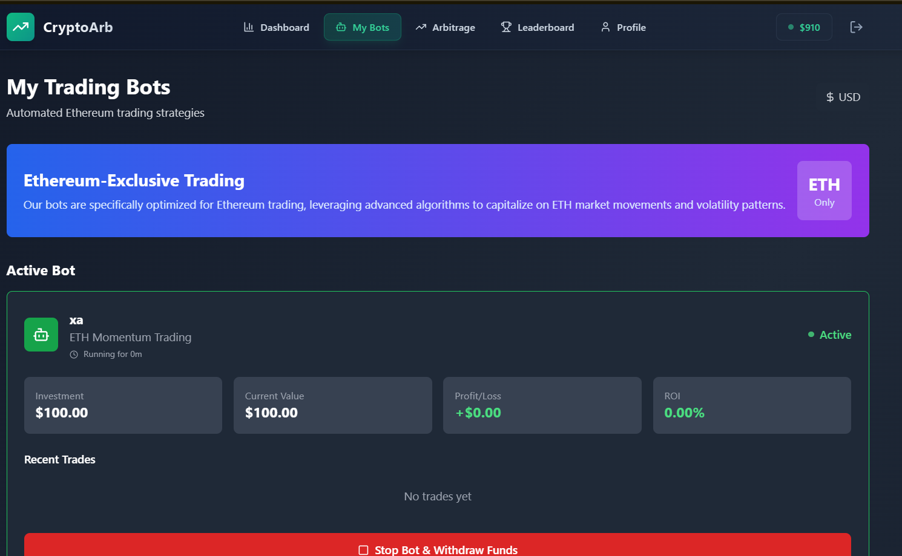

# CryptoArb - Learn, Practice, and Master Crypto Trading with Bots

CryptoArb is a fun, educational, and interactive crypto trading simulator designed for **beginners**, **kids**, and **bot enthusiasts**. Whether you're just starting to learn about cryptocurrencies, want to practice trading with zero risk, or are curious about how trading bots work, CryptoArb is the perfect playground!

---

## What is CryptoArb?

CryptoArb is a full-stack web application that lets you:
- **Learn the basics of crypto trading** in a safe, virtual environment.
- **Practice trading** with $1000 in virtual capital—no real money required!
- **Explore automated trading bots** and arbitrage strategies.
- **Compete on leaderboards** and earn achievements.
- **Visualize real-time price movements** with beautiful, animated charts.

CryptoArb is built to be accessible for all ages, including kids and absolute beginners. The interface is simple, mobile-friendly, and gamified to make learning about crypto fun and engaging.

---

## Who is CryptoArb for?

- **Beginners & Students:** Learn how crypto markets work, what trading means, and how to manage risk.
- **Kids & Young Learners:** Safe, no-risk environment to explore digital finance and technology.
- **Bot Enthusiasts:** Experiment with automated trading bots and see how strategies perform.
- **Gamers & Competitors:** Climb the leaderboard, unlock achievements, and challenge your friends!

---

## Features

- **Virtual Trading:** Start with $1000 in virtual money—practice, learn, and experiment freely.
- **Real-time Prices:** See live crypto prices and animated charts (no real money needed).
- **Trading Bots:** Deploy AI-powered bots and arbitrage strategies, and watch them trade for you.
- **Gamified Experience:** Earn badges, compete on leaderboards, and track your progress.
- **Mobile-First Design:** Works great on phones, tablets, and desktops.
- **Portfolio Management:** Track your trades, profits, and crypto holdings.
- **Educational:** Tooltips, guides, and simple explanations throughout the app.

---

## Demo

Try CryptoArb instantly!  
**Live Demo:** [https://arnavcryptoapp.netlify.app](https://cryptoarb-demo.example.com)  
*(If running locally, see instructions below.)*

---

## Video Demo

Watch a quick video walkthrough of CryptoArb:

<div align="center">
  <a href="https://player.cloudinary.com/embed/?cloud_name=dnyrdbyes&public_id=CryptoApp_oljadf&profile=cld-default" target="_blank">
    
    <p><strong>👆 Click to watch the video demo</strong></p>
  </a>
</div>

---

## Screenshots

Here are some screenshots of CryptoArb in action:

**Dashboard**  


**Arbitrage Strategies**  


**My Bots**  


**Leaderboard**  


**Profile**  


> _Screenshots are for demonstration purposes only._

---

## Tech Stack

- **Frontend:** React + TypeScript + TailwindCSS
- **Backend:** Node.js + Express.js
- **Database:** MongoDB
- **Real-time:** Socket.IO for live price updates
- **Charts:** Recharts for animated price visualization
- **Authentication:** JWT-based secure login

---

## Getting Started

### Prerequisites

- Node.js (v18 or higher)
- MongoDB (local or cloud instance)

### Installation

1. **Clone the repository**
2. **Install dependencies:**
   ```bash
   npm install
   ```
3. **Start MongoDB** on your local machine or update the connection string in `server/index.js`
4. **Start the backend server:**
   ```bash
   npm run server
   ```
5. **Start the frontend development server:**
   ```bash
   npm run dev
   ```
6. **Open your browser:**  
   Go to [http://localhost:5173](http://localhost:5173)

---

## How to Use CryptoArb

1. **Register:** Create a free account and receive $1000 in virtual capital.
2. **Dashboard:** View live crypto prices, animated charts, and your portfolio.
3. **Trading:** Buy and sell cryptocurrencies with your virtual money.
4. **Bots & Arbitrage:** Deploy trading bots and arbitrage strategies—watch them trade and grow your balance automatically!
5. **Leaderboard:** Compete with other users and see who’s the top trader.
6. **Profile:** Track your trading history, bot performance, and achievements.

---

## API Endpoints

- `POST /api/register` — Register a new user
- `POST /api/login` — Login to your account
- `GET /api/profile` — Get your profile, trades, and portfolio
- `POST /api/trade` — Execute buy/sell trades
- `POST /api/arbitrage` — Invest in arbitrage strategies
- `GET /api/leaderboard` — See the top traders
- `GET /api/prices` — Get current crypto prices

---

## Real-time & Security Features

- **Live Updates:** Prices and portfolio values update instantly.
- **Safe & Secure:** Passwords are hashed, JWT authentication, CORS, and security headers.
- **No Real Money:** 100% virtual—perfect for learning and experimenting.

---

## Why CryptoArb is Great for Learning

- **Simple Explanations:** Every feature is explained in plain language.
- **Visual Learning:** Animated charts and stats make it easy to understand market movements.
- **No Risk:** Lose virtual money, not real money—learn from mistakes safely.
- **Experiment Freely:** Try out bots, strategies, and trades without fear.
- **Fun for All Ages:** Designed to be accessible and engaging for everyone.

---

## Contributing

1. Fork the repository
2. Create a feature branch
3. Commit your changes
4. Push to your branch
5. Create a Pull Request

---

## License

This project is licensed under the MIT License.

---